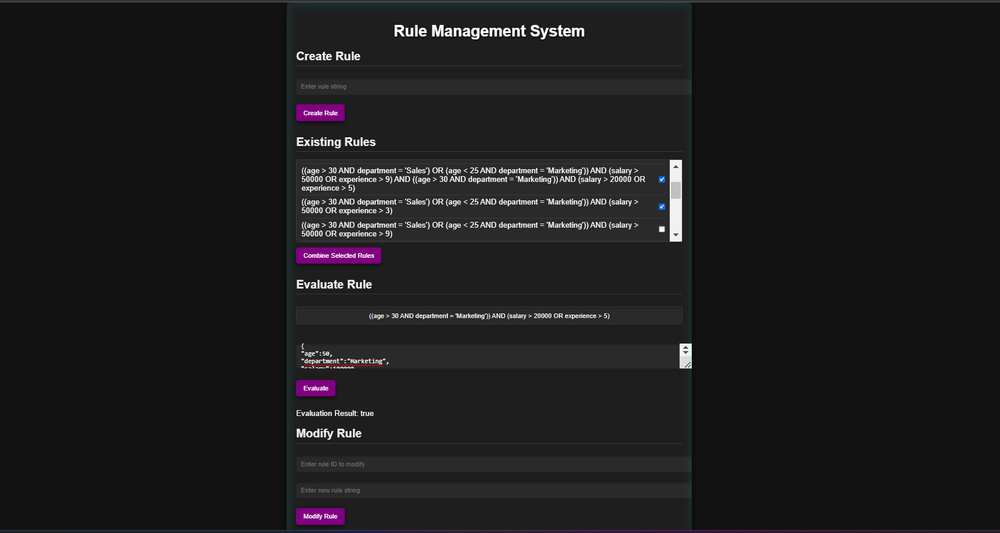

# Rule Management System

## Overview

The Rule Management System is a web application that allows users to create, modify, combine, and evaluate rules defined in a specific string format. The application is built using React for the frontend and Flask with SQLAlchemy for the backend.





## Features

- **Create Rules**: Users can create new rules by entering a rule string.
- **Modify Rules**: Existing rules can be modified by updating the rule string.
- **Combine Rules**: Users can select multiple rules and combine them into a single rule.
- **Evaluate Rules**: Rules can be evaluated against JSON data to determine if they hold true.
- **View Existing Rules**: Users can view a list of all existing rules.

## Technologies Used

- **Frontend**: React, Axios
- **Backend**: Flask, SQLAlchemy, SQLite
- **Styling**: CSS

**APP COMPONENTS**

1. CREATE RULE : will create a rule.
   for eg: "((age > 30 AND department = 'Sales') OR (age < 25 AND
   department = 'Marketing')) AND (salary > 50000 OR experience >
   5)"
2. COMBINE RULE : Click on check boxes you want to combine and it would combine more
3. EVALUATE RULE : Select any rule from the dropdown menu and add data params that you need to provide in json format, we get the response as true or false
4. MODIFY RULE : Input the rule id and add the modified rule

### Frontend Setup

1. Navigate to the frontend directory:

   ```bash
   cd frontend

   ```

2. Install the required packages:

   ```bash
   npm install

   ```

3. Start the React application:
   ```bash
   npm start
   ```

### Backend Setup

1. Navigate to the backend directory:

   ```bash
   cd backend

   ```

2. Create a virtual environment:

   ```bash
   python -m venv venv

   ```

3. Activate the virtual environment:

   ```bash
   venv\Scripts\activate

   ```

4. Install the required Python packages:

   ```bash
   pip install flask sqlalchemy

   ```

5. Run the Flask application:
   ```bash
   python main.py
   ```

